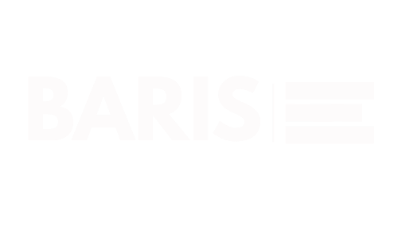

# BARIS — Bisnis Alternatif Risk Intelligent Scoring

> Platform penilaian kelayakan kredit alternatif untuk UMKM Indonesia berbasis AI



---

## 🎯 Tentang BARIS

BARIS hadir untuk menjawab tantangan nyata: **65 juta UMKM Indonesia** tidak bisa mengakses pembiayaan formal bukan karena mereka tidak layak, melainkan karena sistem kredit konvensional mensyaratkan laporan keuangan dan riwayat perbankan yang hampir mustahil dipenuhi pelaku usaha informal.

BARIS menilai kelayakan kredit menggunakan **data alternatif non-finansial** yang bisa diakses siapapun:
- Reputasi digital usaha dari ulasan pelanggan
- Konsistensi operasional harian
- Kematangan dan skala bisnis
- Profil diversifikasi risiko

Hasilnya: **Skor Kredit Alternatif (0–100)** yang transparan, inklusif, dan dilengkapi rekomendasi konkret — tanpa laporan keuangan, tanpa rekening bank, tanpa agunan.

---

## 🔗 Live Demo

**[baris-app.vercel.app](https://baris-app.vercel.app/)**

---

## ✨ Fitur Utama

| Fitur | Deskripsi |
|---|---|
| 🗣️ **Conversational Form** | 8 pertanyaan profil usaha dengan antarmuka chat — jawaban tombol pilihan, tidak perlu mengetik panjang |
| 📸 **OCR Screenshot Ulasan** | Upload screenshot ulasan dari Shopee/Tokopedia/Google Maps — **Azure Computer Vision** baca otomatis |
| 🤖 **Analisis Sentimen AI** | **Azure AI Language** menganalisis sentimen ulasan pelanggan secara objektif |
| 📊 **Dashboard Skor Visual** | Skor 0–100 dengan breakdown 4 dimensi, rating A–E, dan AI Confidence Score |
| 💡 **Score Simulator** | Fitur "Bagaimana Jika?" — simulasi kenaikan skor real-time dengan slider interaktif |
| 📄 **Laporan PDF Resmi** | Generate laporan PDF berlogo BARIS dengan nomor referensi unik — siap dibawa ke lembaga keuangan |

---

## 🧮 Dimensi Penilaian

```
Reputasi Digital        (30%) — Sentimen ulasan pelanggan via Azure AI Language
Konsistensi Operasional (25%) — Hari operasi, platform online, frekuensi update
Kematangan Bisnis       (25%) — Usia usaha, kategori, skala operasional
Profil Risiko           (20%) — Diversifikasi produk dan platform
```

---

## 🛠️ Tech Stack

| Kategori | Teknologi |
|---|---|
| Frontend | React.js + Tailwind CSS v3 |
| Routing | React Router DOM |
| **AI Service 1** | **Azure AI Language** — Sentiment Analysis |
| **AI Service 2** | **Azure Computer Vision** — OCR Screenshot |
| Hosting | Vercel |
| PDF Export | jsPDF + html2canvas |
| Font | Poppins (Google Fonts) |

---

## 🚀 Cara Menjalankan Lokal

### Prerequisites
- Node.js v18+
- npm v9+
- Akun Azure (untuk API keys)

### 1. Clone Repository

```bash
git clone https://github.com/arbyalia/baris-app.git
cd baris-app
```

### 2. Install Dependencies

```bash
npm install
```

### 3. Setup Environment Variables

Buat file `.env` di root folder:

```env
REACT_APP_AZURE_LANGUAGE_KEY=your_azure_language_key
REACT_APP_AZURE_LANGUAGE_ENDPOINT=https://your-resource.cognitiveservices.azure.com/

REACT_APP_AZURE_VISION_KEY=your_azure_vision_key
REACT_APP_AZURE_VISION_ENDPOINT=https://your-resource.cognitiveservices.azure.com/
```

### 4. Jalankan Development Server

```bash
npm start
```

Buka [http://localhost:3000](http://localhost:3000) di browser.

---

## 📱 Alur Penggunaan

```
1. Halaman Utama
   └── Klik "Mulai Penilaian Gratis"
       │
2. Profil Usaha (8 pertanyaan)
   └── Jawab pertanyaan seputar usaha
       │
3. Ulasan Pelanggan
   ├── Upload screenshot → Azure Computer Vision baca otomatis (OCR)
   └── Atau paste manual ulasan
       │
4. Proses Analisis AI
   └── Azure AI Language menganalisis sentimen
       │
5. Dashboard Hasil
   ├── Skor 0–100 + Rating A–E
   ├── Breakdown 4 dimensi
   ├── Rekomendasi actionable
   ├── Score Simulator "Bagaimana Jika?"
   └── Unduh Laporan PDF Resmi
```

---

## 🏗️ Struktur Project

```
baris-app/
├── public/
│   ├── index.html
│   └── BARIS.png
├── src/
│   ├── components/
│   │   ├── onboarding/      # Conversational form
│   │   ├── reviews/         # OCR upload + manual input
│   │   ├── dashboard/       # Score display + dimension cards
│   │   ├── simulator/       # Score simulator
│   │   ├── report/          # PDF generator
│   │   └── shared/          # Reusable components
│   ├── pages/               # Route-level pages
│   ├── services/
│   │   ├── azureLanguage.js # Azure AI Language wrapper
│   │   └── azureVision.js   # Azure Computer Vision wrapper
│   ├── utils/
│   │   ├── scoringEngine.js # Core scoring algorithm
│   │   ├── recommendations.js
│   │   └── reviewExtractor.js
│   └── context/
│       └── BarisContext.jsx # Global state
└── tailwind.config.js
```

---

## ☁️ Azure Services

| Service | Tier | Fungsi |
|---|---|---|
| Azure AI Language | Free F0 | Analisis sentimen ulasan pelanggan |
| Azure Computer Vision | Free F0 | OCR screenshot ulasan |

---

## 🏆 Hackathon

Proyek ini dikembangkan untuk **AI Impact Challenge Dicoding 2026** dalam rangka program **Microsoft Elevate Training Center**.

- **Tema:** No. 19 — Akses Pembiayaan & Credit Scoring UMKM
- **Kategori:** Real Sector Economy
- **Developer:** Arby Ali Amaludin

---

## 📄 Lisensi

MIT License — bebas digunakan dan dikembangkan lebih lanjut.

---
